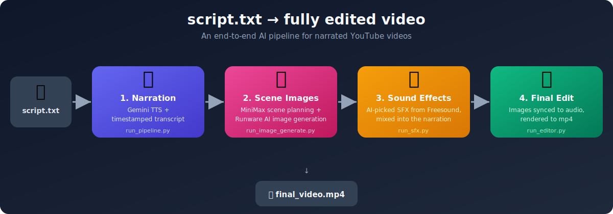

# ScriptSmith-Engine

[](https://github.com/TheUnknown550/ScriptSmith-Engine/actions/workflows/ci.yml)
[](LICENSE)



## Introduction

ScriptSmith-Engine turns a plain text script into a fully edited, narrated YouTube video — automatically.

Write your script as a `.txt` file, then run a small pipeline of scripts that:

1. **Narrates it** with Gemini TTS and transcribes the result into timestamped segments.
2. **Plans and generates scene images** with AI (MiniMax for scene planning, Runware/GPT Image for the artwork), synced to those timestamps.
3. **Adds sound effects**, automatically picked and placed by AI and sourced from Freesound.
4. **Assembles everything** into a final video, syncing images and audio on a timeline.

The goal is to go from "I have a script" to "I have a video" with minimal manual editing — each step can also be run independently, so you can swap in your own audio, images, or SFX at any stage.

```
run_pipeline.py         →  narration audio + timestamps
run_image_generate.py   →  scene plan + AI images
run_sfx.py              →  sound effects mixed into audio
run_editor.py           →  final video
```

## Quick Start

```powershell
git clone https://github.com/TheUnknown550/ScriptSmith-Engine.git
cd ScriptSmith-Engine

python -m venv .venv
.\.venv\Scripts\activate

pip install -r requirements.txt
cp .env.example .env

python run_pipeline.py
python run_image_generate.py
python run_sfx.py
python run_editor.py
```

> Fill in your API keys in `.env` before running the pipeline — see [APIs Required](#apis-required) below. Each script can also be run on its own; see the per-part sections further down for options.

## APIs Required

This project relies on a few external services. You'll need an API key for each:

| Service | Used for | Get a key |
|---|---|---|
| [Google Gemini](https://ai.google.dev/) | Text-to-speech narration (`GOOGLE_API_KEY`) | [aistudio.google.com](https://aistudio.google.com/) |
| [MiniMax](https://www.minimax.io/) | Scene planning + sound effect planning (`MINIMAX_API_KEY`) | [minimax.io](https://www.minimax.io/) |
| [Runware](https://runware.ai/) | AI scene image generation (`RUNWARE_API_KEY`) | [runware.ai](https://runware.ai/) |
| [Freesound](https://freesound.org/) | Sound effect search and download (`FREESOUND_API_KEY`, `FREESOUND_CLIENT_ID`, `FREESOUND_CLIENT_SECRET`) | [freesound.org/apiv2/apply](https://freesound.org/apiv2/apply/) |

Also required locally:
- [FFmpeg](https://ffmpeg.org/download.html) — audio/video processing (must be on your `PATH`)
- A CUDA-capable GPU is recommended for transcription (`faster-whisper`), but not required

## Setup

```powershell
.\.venv\Scripts\activate
pip install -r requirements.txt
```

Copy `.env.example` to `.env` and fill in your API keys:

```powershell
cp .env.example .env
```

```
GOOGLE_API_KEY=        # Gemini TTS
MINIMAX_API_KEY=       # Scene planning + SFX planning
RUNWARE_API_KEY=       # Image generation
FREESOUND_API_KEY=     # SFX search and download
FREESOUND_CLIENT_ID=   # Freesound app client ID
FREESOUND_CLIENT_SECRET=
```

---

## Part 1 — Audio + Timestamps

Reads `script.txt`, generates narration with Gemini TTS, and transcribes it into per-segment timestamps.

```powershell
python run_pipeline.py
```

For slightly slower pacing:

```powershell
python run_pipeline.py --pace 0.90
```

Reuse existing audio and only regenerate timestamps:

```powershell
python run_pipeline.py --skip-tts
```

**Outputs:**
- `output/audio/full.wav`
- `output/transcripts/segments.json`
- `output/transcripts/segments.txt`
- `output/transcripts/segments.srt`

The script is split into 1–6 requests depending on word count (roughly 250 words per request, capped at 6 total). Each chunk is loudness-normalised and crossfaded at the join so the result sounds like one continuous recording.

---

## Part 2 — Scene Planning + Image Generation

Uses MiniMax M3 to read transcript segments and write one image prompt per scene. Images are generated via Runware (GPT Image 2).

Build only the scene plan (no images generated, fast):

```powershell
python run_image_generate.py --plan-only
```

Build scene plan and generate all images:

```powershell
python run_image_generate.py
```

Reuse existing scene plan and generate images only:

```powershell
python run_image_generator.py --generate-only
```

Generate one random scene to test image quality:

```powershell
python run_image_generator.py --generate-only --test
```

**Outputs:**
- `output/image_plan/scene_plan.json`
- `output/image_plan/scene_prompts.txt`
- `output/images/<timestamp>.png`

Image filenames are timestamp-only (e.g. `01-40-700.png`) so the editor can read them directly without needing the transcript.

To control image quality and cost, set in `.env`:

```
RUNWARE_IMAGE_QUALITY=low     # $0.006/image  ← default
RUNWARE_IMAGE_QUALITY=medium  # $0.053/image
RUNWARE_IMAGE_QUALITY=high    # $0.211/image
```

If `MINIMAX_API_KEY` is missing the planner falls back to a local heuristic.

---

## Part 3 — Sound Effects

Uses MiniMax to decide which scenes get a sound effect, searches Freesound for each, downloads the audio, and mixes it into the narration at the correct timestamp.

Plan SFX and download files (no mixing yet — good for reviewing choices):

```powershell
python run_sfx.py --plan-only
```

Full run — plan, download, and mix:

```powershell
python run_sfx.py
```

Reuse existing SFX plan and only re-mix:

```powershell
python run_sfx.py --mix-only
```

**Outputs:**
- `output/sfx_plan/sfx_plan.json` — which scenes get SFX, what was found, volume levels
- `output/sfx/*.mp3` — downloaded Freesound previews (cached, reused on reruns)
- `output/audio/full_with_sfx.wav` — narration with SFX mixed in

**How density is controlled:**
- 1 SFX per ~20 seconds of video maximum
- MiniMax targets hard scene changes, major reveals, the first scene, and the last scene
- Narration stays at full volume; SFX are layered underneath at 0.15–0.55 volume
- Leading silence is stripped from each SFX file so the hit lands exactly on the scene change

To adjust volumes or swap a sound, edit `output/sfx_plan/sfx_plan.json` and run `--mix-only`.

---

## Part 4 — Editor

Stitches scene images into a video synced to the narration audio.

Using the AI-generated images (default):

```powershell
python run_editor.py
```

Using images from a custom folder:

```powershell
python run_editor.py --images "D:\path\to\img"
```

Using the SFX-mixed audio:

```powershell
python run_editor.py --audio output\audio\full_with_sfx.wav
```

Full run with custom images and SFX audio:

```powershell
python run_editor.py --images "D:\path\to\img" --audio output\audio\full_with_sfx.wav
```

**Output:**
- `output/video/final_video.mp4`

The editor auto-detects whether your images have timestamp filenames (e.g. `01-40-700.png`) and uses them as timeline anchors. If they don't, it falls back to pairing images to transcript segments in order. GPU encoding (`h264_nvenc`) is used automatically if available.

---

## Example

The [`examples/`](examples) folder contains a real sample run end-to-end:

- [`examples/script.txt`](examples/script.txt) — a complete sample input script
- [`examples/scene_plan.json`](examples/scene_plan.json) — the AI-generated scene plan for the opening scenes (output of Part 2)
- [`examples/final_video_preview.mp4`](examples/final_video_preview.mp4) — a short preview clip of the final rendered video (output of Part 4)

Use `examples/script.txt` as `script.txt` to try the full pipeline yourself.

---

## License

MIT — see [LICENSE](LICENSE).
